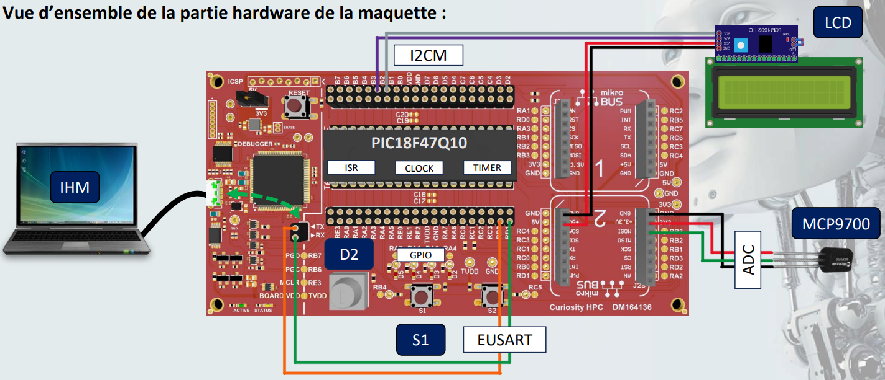
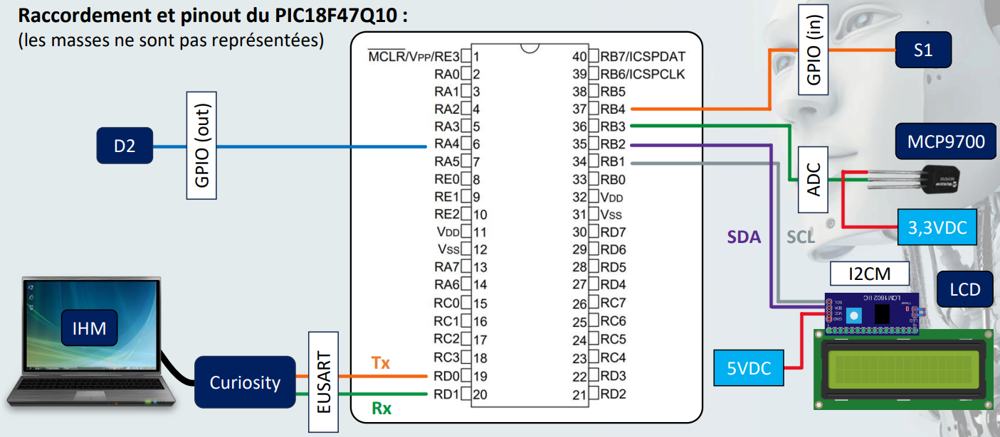

# Projet Thermomètre - Système de mesure de température

## Introduction

Ce projet Thermomètre consiste à concevoir un **thermomètre numérique** capable de mesurer la température ambiante (en °C). Il est basé sur le microcontrôleur **PIC18F47Q10**, et intègre un capteur de température **MCP9700**, un écran LCD pour l’affichage et une communication série via **EUSART** pour l'IHM.

Le développement se fait en **C** avec **MPLAB X IDE** et le compilateur **XC8**.

## Objectifs du projet

- **Mesure de la température** : Utilisation du capteur MCP9700 pour récupérer la température via l’ADC du microcontrôleur.
- **Affichage en temps réel** : Affichage de la température sur un écran LCD 16x2 via I2C.
- **Activation/Désactivation du mode mesure** : Gestion du mode mesure avec un bouton poussoir et une LED d'indication.
- **Communication avec une IHM** : Transmission périodique de la température et du statut à l'IHM via EUSART.

## Contenu du dépôt

Ce dépôt contient les fichiers suivants :

### Dossiers et fichiers

- **[.img/](./img/)** : Contient les fichiers image du projet (logos et schémas).
  - **[Raccordement_pinout_PIC18F47Q10.png](./img/Raccordement_pinout_PIC18F47Q10.png)** : Schéma du raccordement et pinout du microcontrôleur PIC18F47Q10.
  - **[Vue_hardware_maquette.png](./img/Vue_hardware_maquette.png)** : Vue d'ensemble du matériel utilisé dans le projet.
- **[nbproject/](./nbproject/)** : Contient les fichiers de configuration du projet pour l'environnement **MPLAB X IDE**.
- **[src/](./src/)** : Contient le code source du projet structuré en plusieurs dossiers :
  - **[APPLICATION/AppManager/](./src/APPLICATION/AppManager/)** : Logiciel de gestion de l’application.
  - **[DRIVERS/LCD/](./src/DRIVERS/LCD/)** : Driver pour l’affichage LCD via I2C.
  - **[DRIVERS/MCP9700/](./src/DRIVERS/MCP9700/)** : Driver pour le capteur de température MCP9700.
  - **[DRIVERS/SERP/](./src/DRIVERS/SERP/)** : Gestion de la communication série via EUSART.
  - **[HARDWARE/ADC/](./src/HARDWARE/ADC/)** : Configuration du module ADC pour la lecture du capteur de température.
  - **[HARDWARE/GPIO/](./src/HARDWARE/GPIO/)** : Gestion du bouton poussoir et de la LED.
  - **[HARDWARE/TIMER/](./src/HARDWARE/TIMER/)** : Gestion du timer pour la périodicité des mesures.
- **[TOOLS/Common/](./TOOLS/Common/)** : Outils ou scripts communs pour le projet.
- **[main.c](./main.c)** : Code principal du programme.
- **[Makefile](./Makefile)** : Fichier de configuration pour la compilation du projet.
- **[Doxyfile](./Doxyfile)** : Fichier de configuration pour générer la documentation avec Doxygen.
- **[README.md](./README.md)** : Ce fichier.
- **[.gitignore](./.gitignore)** : Liste des fichiers à ignorer dans le dépôt Git.

---

Voici les schémas de la maquette du projet :

**Vue d'ensemble de la maquette matérielle utilisée dans le projet.**

**Schéma du raccordement du PIC18F47Q10**.

---

Ce projet permet d’appliquer les principes du développement embarqué tout en intégrant les aspects matériels et logiciels pour réaliser un thermomètre numérique complet.
